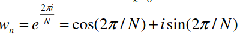
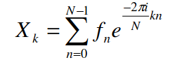
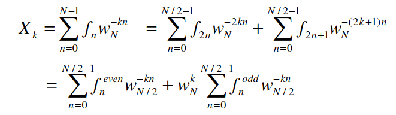

#  Преобразование Фурье

## структура репы

- `cpp/` - реализация на плюсах
- `test_data/` - примеры файлов с входным вектором (формат: первая строка - длина n вектора X, потом xi на i+1-й строке), и ожидаемые результаты(без n и в "читаемом" формате, т.е. 3+i, вместо какого-нибудь (3.0, 0.999999)). Длина i-го тестового массива = 2^i
- `материалы/` - всякие pdf

### материалы

1. [статья](материалы/parallel_fft.pdf)
2. [rosetta code](https://rosettacode.org/wiki/Fast_Fourier_transform)
3. [формулы](https://srikarthiks.files.wordpress.com/2019/01/r-parallel-programming-in-c-with-mpi-and-openmp.pdf)

## DFT

1. Считывается входной вектор X, который надо преобразовать, его длина N = |X|.
2. Вычисляется первообразный Nn-й корень из единицы wn, по формуле: wN = e^(-2pi/N) = cos(2p/N)+i * sin(2p/N). тут i - мнимая единица

3. Вычисляется матрица A коэффициентов (twiddle coefficients) по следующей формуле: каждый элемент aij = wN^(i * j)
4. Матрица A умножается на X. Результат A * X = Y и есть дискретное преобразование Фурье

За счёт п.3 сложность O(N^2) - мультипликативных операций пропорционально количеству элементов в матрице (N * N). При этом матрица коэффициентов симметрична по обеим диагоналям.

Т.о. один элемент выходного вектор можно получить по следующей формуле:

## FFT
### быстре чем DFT, но еще не распараллелено

Суть в том, чтобы не считать всю матрицу A из п.3(N^2 мультипликативных операций), а использовать стратегию "divide-and-conquer". 

Элемент выходного вектор Yk можно за счёт симметричности матрицы коэффициентов получить по следующей формуле:

Итого, теперь, чтобы посчитать один из N элементов выходного вектора, надо сделать не N, а log(N) вычислений. Отсюда и общая сложность (для вычисления всех N элементов выходного вектора) теперь O(Nlog(N).

## Parallel FFT

Время вычисления одного элемента вектора можно сократить в p раз, где p - количество потоков. Таким образом, время выполнения можно сократить до O(Nlog(N/p)).