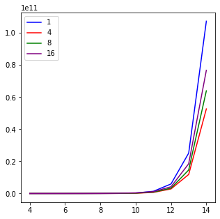
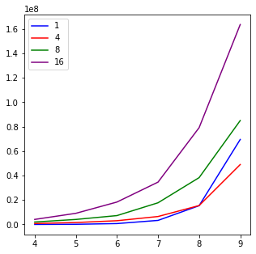

## Отчёт

### Задача

FFT - Fast Fourier Transform (быстрое преобразование Фурье) - быстрая версия алгоритма DFT - Discrete Fourier Transoform (дискретного преобразования Фурье) - преобразования вектора входных сигналов X в вектор выходных сигналов Y. 

### Железо

*тут будет инфа про проц*

#### c++

Было реализовано 2 функции, вычисляющие результат для одних и того же набора данных разной величины. Первая вычисляла результат последовательно, вторая - параллельно при различных задаваемых количествах потоков.

Ниже приведен график изменения времени выполнения функции при увеличении размера входного массива от длины 2^2 до 2^14 при различных количествах потоков.

На графике видно, что количество потоков более 4х является избыточным для этой функции, так как ускорение не значительно. Это объясняется соответствующим уровнем зернистости алгоритма.

Увеличение скорости при меньших длинах массивов наглядно демонстрирует избыточность распараллеливания даже на 4 потока.

Ускорения в цифрах:

speedup on **4** threads: **2.037**
speedup on **8** threads: **1.678**
speedup on **16** threads: **1.398**

#### erlang